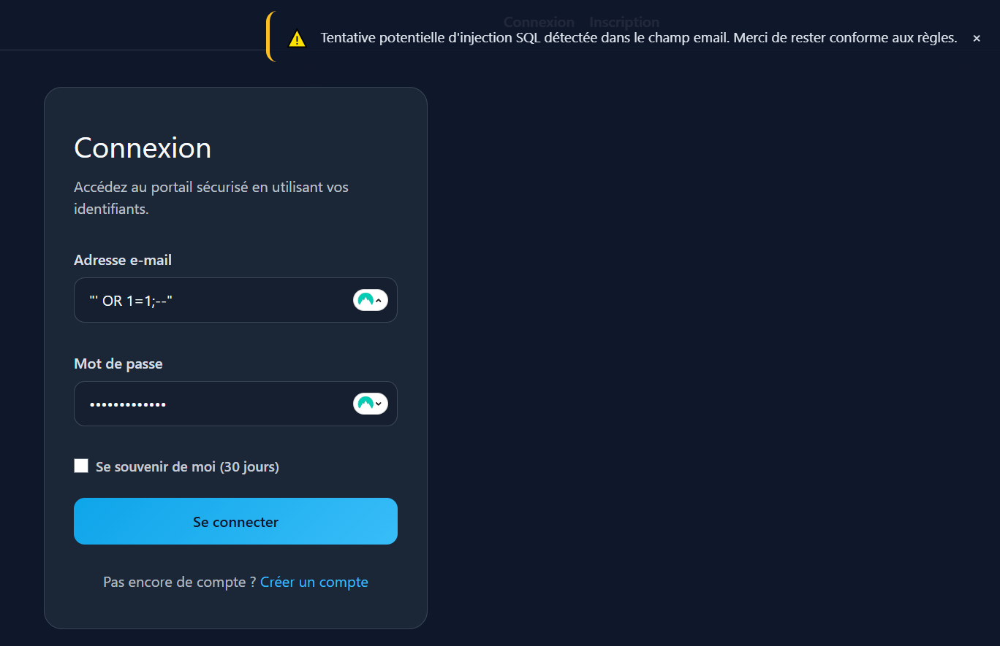
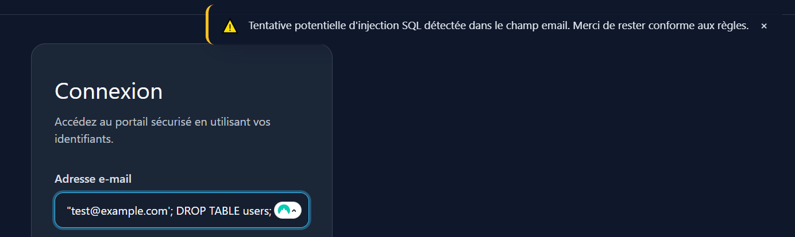
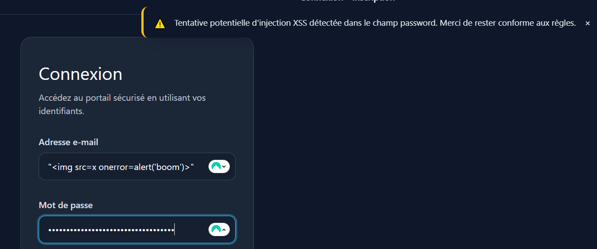
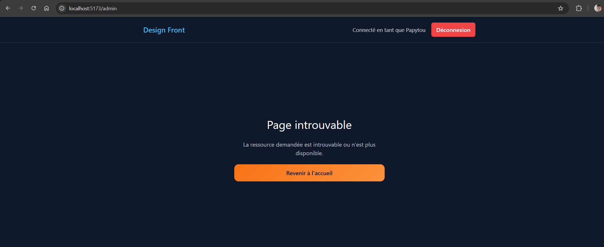

# Design Front (SvelteKit)

Interface SvelteKit 2 pour la couche présentation du projet **Design Pattern Sécurité**. Ce frontend consomme l’API sécurisée du dossier `designpatern` et expose côté utilisateur les mêmes garanties : validation forte, détection des injections, gestion stricte de la session et contrôle d’accès par rôle.

## 1. Installation & configuration

```powershell
git clone <votre_repo>
cd design-front
npm install

copy .env.example .env
	# API_BASE_URL=http://localhost:3000
	# API_KEY=clé fournie par l'API (x-api-key)


```

Le client tourne sur `http://localhost:5173`. Démarrez l’API `designpatern` (port `3000`) pour que les appels REST soient disponibles.

## 2. Architecture & ponts de sécurité

| Brique | Rôle | Fichiers | Lien avec `designpatern` |
| --- | --- | --- | --- |
| **Session & API client** | Monte `event.locals.api`, rafraîchit les cookies sécurisés, ajoute la clé API et les tokens | `src/hooks.server.ts` | S’aligne sur `AuthenticationEnforcer`, `apiConfigMiddleware.config.ts` et la politique de tokens |
| **Formulaires superforms** | Validation SSR + messages synchronisés | `src/routes/(auth)/login/+page.server.ts`, `register/+page.server.ts` | Réutilise les règles définies côté backend (`Validators`, Vine/Zod) |
| **Détection d’injection** | Analyse heuristique des inputs et avertissement toast | `src/lib/utils/detectInjection.ts`, `src/routes/(auth)/*/+page.svelte` | Complète `sanitizeData`, `validateData`, et le logger d’audit |
| **RBAC visuel** | Affiche/masque les écrans sensibles selon le rôle | `src/routes/+layout.svelte`, `src/routes/+page.svelte`, `src/routes/admin/*` | Miroir des autorisations `authorizationEnforcer.ts` |
| **UX sécurité** | Feedback utilisateur (toasts, erreurs, redirections) | `src/lib/stores/toast.ts`, `Toast.svelte`, `admin/+error.svelte` | S’appuie sur les messages de l’API (`returnSuccess`, `errorHandler`) |
| **Rate limiting** | Message dédié sur les réponses 429 | `src/routes/(auth)/login/+page.server.ts` | Cohérent avec `Middlewares/rateLimiter` |

## 3. Parcours utilisateur et sécurité associée

| Route | Fonctionnalité | Sécurité assurée | Fichiers clés |
| --- | --- | --- | --- |
| `/(auth)/register` | Création de compte | Validation Zod, détection injection temps réel, messages contextualisés | `register/+page.server.ts`, `register/+page.svelte`, `src/lib/schemas/auth.ts` |
| `/(auth)/login` | Authentification | Détection SQL/XSS, message 429, persistance session | `login/+page.server.ts`, `login/+page.svelte`, `src/lib/server/auth.ts` |
| `/logout` | Déconnexion | Purge des cookies HTTP only + appel API sécurisé | `src/routes/logout/+server.ts` |
| `/` | Tableau principal | Liste utilisateurs si rôle ADMIN, sinon message RBAC | `src/routes/+page.server.ts`, `src/routes/+page.svelte` |
| `/admin` | Dashboard administrateur | Vérification ADMIN, redirection login ou 404 si non autorisé | `src/routes/admin/+page.server.ts`, `src/routes/admin/+page.svelte`, `src/routes/admin/+error.svelte` |

## 4. Validation & détection côté client

- **Schémas Zod partagés** — `src/lib/schemas/auth.ts` expose `loginSchema` et `registerSchema` (email obligatoire, mot de passe ≥ 12 caractères avec majuscule/minuscule/chiffre/spécial). Les superforms utilisent ces schémas pour valider côté serveur et restituer les messages d’erreur.
- **Détection proactive d’injection** — `src/lib/utils/detectInjection.ts` liste les signatures SQL (`select`, `--`, `1=1`, …) et XSS (`<script>`, `onerror`, `javascript:`). Les pages `login` et `register` observent les champs avec `$effect` :

	```svelte
	$effect(() => {
		warnOnInjection($form.email, 'email');
		warnOnInjection($form.password, 'password');
	});
	```

	```ts
	const detection = detectInjectionAttempt(value);
	if (detection) {
		showToast(`Tentative ${detection.vector} détectée dans ${field}.`, 'warning');
	}
	```

- **Feedback utilisateur** — `src/lib/stores/toast.ts` et `src/lib/components/Toast.svelte` affichent l’alerte. Si l’utilisateur soumet malgré tout, l’API renvoie un message d’erreur repris via `message(form, { type: 'error', text })`.
- **Rate limiting** — Lorsqu’une réponse 429 est reçue, `login/+page.server.ts` force le message « Trop de tentatives détectées… », reflétant le middleware `rateLimiter` côté serveur.
- **RBAC visuel** — `src/routes/+layout.svelte` et `/+page.svelte` conditionnent l’affichage des actions sensibles :

	```svelte
	{#if auth?.user.role === 'ADMIN'}
		<a href="/admin">Espace admin</a>
	{:else}
		<p class="role-hint">Fonctionnalité réservée aux administrateurs.</p>
	{/if}
	```

## 5. Extraits de code sécurité

Quelques extraits illustrent la façon dont le front end s’aligne sur la stack de sécurité du backend :

```ts
// src/hooks.server.ts — proxy authentifié vers l'API designpatern
event.locals.api = async (path, init = {}) => {
	const url = buildApiUrl(path);
	const headers = new Headers(init.headers ?? {});

	if (!headers.has('Content-Type') && init.body && !(init.body instanceof FormData)) {
		headers.set('Content-Type', 'application/json');
	}
	if (API_KEY) {
		headers.set('x-api-key', API_KEY);
	}
	if (event.locals.tokens?.accessToken) {
		headers.set('Authorization', `Bearer ${event.locals.tokens.accessToken}`);
	}
	if (event.locals.tokens?.sessionId && !headers.has('x-session-id')) {
		headers.set('x-session-id', event.locals.tokens.sessionId);
	}

	return event.fetch(url, { ...init, headers });
};
```

```ts
// src/routes/(auth)/login/+page.server.ts — gestion fine des erreurs API
if (!response.ok) {
	let fallbackMessage = 'Connexion impossible. Vérifiez vos identifiants.';
	// Mapping des erreurs champ par champ renvoyées par le backend
	const errorBody = (await response.json()) as { error: string | ApiFieldError[] };
	...
	if (response.status === 429) {
		fallbackMessage = 'Trop de tentatives détectées. Patientez quelques instants avant de réessayer.';
	}
	return message(form, { type: 'error', text: fallbackMessage }, { status: response.status as MessageStatus });
}
```

```ts
// src/routes/+page.server.ts — exposition conditionnelle des ressources sensibles
if (!locals.auth) {
	return base; // utilisateur non connecté → tableau utilisateurs masqué
}

if (locals.auth.user.role !== 'ADMIN') {
	return {
		...base,
		usersError: "Votre rôle actuel ne permet pas de consulter la liste des utilisateurs."
	};
}

const response = await locals.api('/api/users');
```

```ts
// src/routes/admin/+page.server.ts — garde 404 pour les non-admin
if (!locals.auth) {
	throw redirect(303, `/login?redirectTo=${encodeURIComponent(url.pathname)}`);
}

if (locals.auth.user.role !== 'ADMIN') {
	throw error(404, { message: 'Page introuvable.' });
}
```

## 6. Scénarios de test recommandés

1. **Inscription réussie** — créer un nouvel utilisateur et vérifier les refus (email dupliqué, mot de passe faible).
2. **Connexion limitée** — saisir 5 fois un mauvais mot de passe : l’API renvoie 429 et le message « Trop de tentatives détectées… » apparaît.
3. **Injection SQL** — entrer `' OR 1=1;--` dans le champ email : toast warning + message d’erreur serveur.
4. **Injection XSS** — coller `<script>alert('xss')</script>` dans le champ username : toast warning + blocage API.
5. **RBAC utilisateur** — se connecter avec un compte standard : la liste utilisateurs et le lien `/admin` ne sont pas visibles.
6. **RBAC admin** — se connecter avec un compte ADMIN : la table `/api/users` et la page `/admin` sont accessibles.
7. **Accès interdit** — tenter `/admin` sans rôle ADMIN : redirection vers login si non connecté, sinon 404 personnalisée.
8. **Expiration session** — supprimer les cookies `session_id`/`access_token` puis rafraîchir : retour sur la page login.

Conservez des captures et logs pour chaque scénario, utiles au rendu final.

## 7. Scripts utiles

| Commande | Description |
| --- | --- |
| `npm run dev` | Serveur de développement (Vite + HMR) |
| `npm run check` | `svelte-kit sync` + `svelte-check` |
| `npm run build` | Build production |
| `npm run preview` | Prévisualisation du build |

## 8. Captures & preuves visuelles

Les captures sont stockées dans `static/screenshots/` :

- `injectionsql.PNG` — Toast client lors d’une tentative SQL classique (`' OR 1=1;--`).
- `sql.PNG` — Message serveur reçu après soumission du même payload.
- `xss.PNG` — Détection d’un `<script>` injecté côté client.
- `xss2.PNG` — Réponse API indiquant le blocage XSS.
- `ratelimiter.PNG` — Message d’erreur 429 côté UI après trop de tentatives de connexion.
- `404.PNG` — Page 404 dédiée lorsqu’un utilisateur non admin tente d’accéder à `/admin`.







