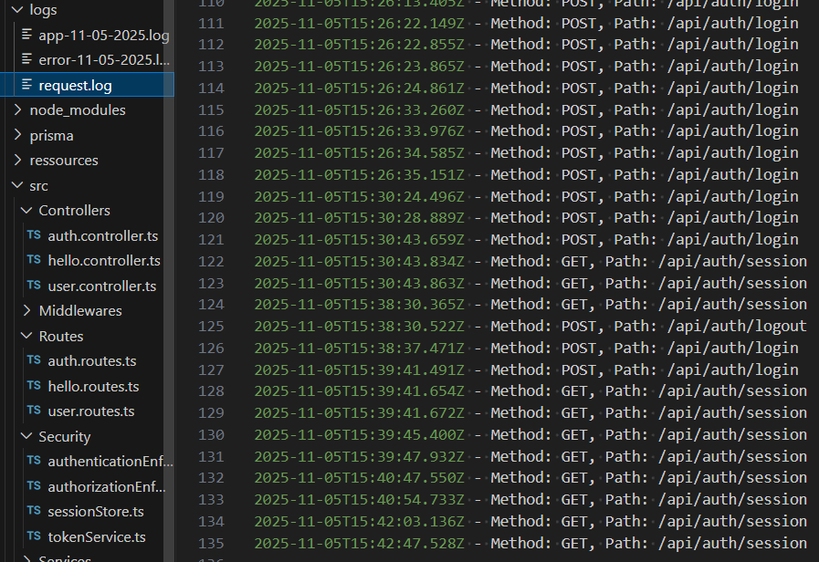
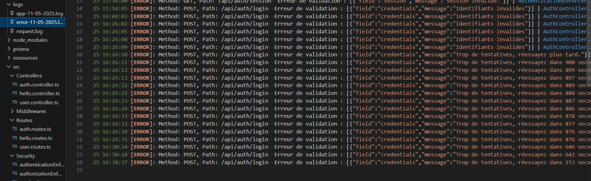
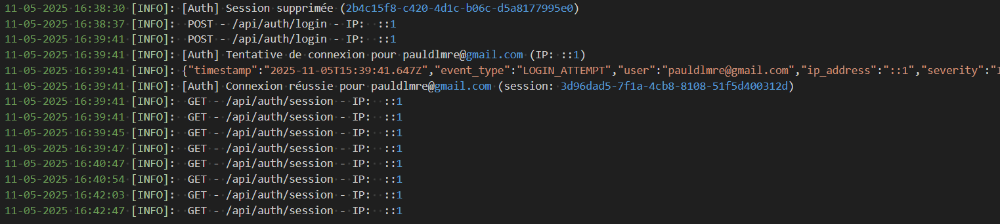

cd Nodejs-TypeScript-Postgres-Prisma-Express
# API Sécurité — Design Pattern

API Node.js/Express documentant l’implémentation demandée dans le TP « Security Patterns ». Elle couvre l’authentification centralisée, le RBAC, la validation côté serveur, l’audit de sécurité et expose les endpoints nécessaires au front SvelteKit.

> ℹ️ **Important** : l’énoncé d’origine vise Flask/Python. Après accord préalable, j’ai répliqué les mêmes patterns en Node.js/Express pour réutiliser le front SvelteKit déjà fourni.

## 1. Installation & lancement

```powershell
git clone <votre_repo>
cd designpatern
npm install

copy .env.exemple .env
  # DATABASE_URL=postgresql://...
  # API_KEY=clé partagée avec le front

npx prisma migrate deploy
npm run dev
```

Les traces sont exportées dans `logs/request.log` (trafic HTTP), `logs/app-*.log` (activité applicative) et `logs/error-*.log` (erreurs). Pour repartir sur une base propre, vider le dossier `logs/`.

## 2. Cartographie des exigences du TP

| Exercice | Implémentation | Fichier clé |
| --- | --- | --- |
| **Auth. Enforcer** | Sessions de 30 min, blocage après 5 échecs, hash Argon2id, rafraîchissement auto | `src/Security/authenticationEnforcer.ts`
| **Authorization (RBAC)** | Matrice rôles ADMIN/MANAGER/USER, middlewares `requirePermission` & `requireSelfOrPermission` | `src/Security/authorizationEnforcer.ts`
| **Validation / Sanitisation** | Schémas Vine, contrôles whitelist, middleware `sanitizeRequestData` (sanitize-html) | `src/Validators/**`, `src/Middlewares/sanitizeData/sanitizeData.middleware.ts`
| **Audit logging** | `SecurityAuditLogger` journalise connexions, accès refusés, anomalies | `src/Utils/audit/securityAuditLogger.ts`
| **Protection transport** | Rate limiting 100 requêtes / 15 min + clé API obligatoire | `config/apiConfigMiddleware.config.ts`, `src/Utils/checkApiKey/checkApiKey.ts`
| **Routes sécurisées** | `/api/auth/*`, `/api/users`, `/api/users/:id` (self/admin), `/api/dashboard` | `src/Routes/*.ts`

## 3. Extraits de code sécurité

### 3.1 Armature API : `apiConfigMiddleware.config.ts`

```ts
const configureMiddleware = (app: express.Application) => {
  app.use(express.json());
  app.use(cors());
  app.use(helmet());

  const limiter = createRateLimiter(15, 100);
  app.use(limiter);

  app.use(sanitizeRequestData);

  app.use((req, res, next) => {
    rotateLog();
    requestLog(req, res, next);
    logger.info(` ${req.method} - ${req.url} - IP:  ${req.ip}`);
  });
};
```

- Limite la fréquence des appels à 100 requêtes sur 15 minutes et journalise chaque requête.
- Applique CORS/Helmet/Compression + Passport (voir fin du fichier) pour l’hygiène transport.
- Assainit toutes les données entrantes avant validation via `sanitizeRequestData`.
- Les hooks SvelteKit reprennent les mêmes en-têtes et la clé API pour rester synchronisés.

### 3.2 Authentification centralisée : `AuthenticationEnforcer`

```ts
public async login(email: string, password: string, context: AuthenticationContext = {}) {
  this.purgeExpiredSessions();

  const normalizedEmail = email.trim().toLowerCase();
  const attemptKey = this.getAttemptKey(normalizedEmail, context);
  this.ensureNotBlocked(normalizedEmail, context, attemptKey);

  const userRecord = await bdd.user.findUnique({ where: { email: normalizedEmail } });
  if (!userRecord) {
    this.invalidCredentials(normalizedEmail, context, 'Utilisateur inconnu', attemptKey);
  }

  const isPasswordValid = await this.verifyPassword(password, userRecord.password);
  if (!isPasswordValid) {
    this.invalidCredentials(normalizedEmail, context, 'Mot de passe invalide', attemptKey);
  }

  const { password: _ignored, ...safeUser } = userRecord;
  const session = this.createSession(safeUser);
  this.resetLoginAttempts(attemptKey);
  securityAuditLogger.logLoginAttempt(safeUser.email, context.ip, true, { sessionId: session.id });

  return { sessionId: session.id, user: safeUser, expiresAt: session.expiresAt };
}
```

- Hash Argon2id (`verifyPassword`) et purge systématique des sessions expirées.
- Blocage IP/utilisateur après 5 échecs sur 5 minutes (`ensureNotBlocked` + `registerFailedAttempt`).
- Traçabilité audit homogène (`logLoginAttempt`, `logAnomaly`) et rafraîchissement TTL dans `checkAuthentication()`.

### 3.3 Autorisations & RBAC : `authorizationEnforcer.ts`

```ts
public requirePermission(action: Action, resource: Resource) {
  return (req, res, next) => {
    const user = res.locals.authenticatedUser;
    if (!user?.role) {
      securityAuditLogger.logUnauthorizedAccess(user?.email, req.ip, resource, `Permission ${action} requise`);
      return handleError({ status: 401, error: [{ field: 'authorization', message: 'Authentification requise.' }] }, req, res);
    }

    if (!this.canAccess(user.role, action)) {
      securityAuditLogger.logUnauthorizedAccess(user.email, req.ip, resource, `Permission ${action} insuffisante`);
      return handleError({ status: 403, error: [{ field: 'authorization', message: 'Accès interdit pour ce rôle.' }] }, req, res);
    }

    next();
  };
}

public requireSelfOrPermission(action: Action, resource: Resource, extractTargetId: (req: Request) => string | undefined) {
  return (req, res, next) => {
    const user = res.locals.authenticatedUser;
    if (!user?.id || !user.role) {
      securityAuditLogger.logUnauthorizedAccess(user?.email, req.ip, resource, 'Session absente');
      return handleError({ status: 401, error: [{ field: 'authorization', message: 'Authentification requise.' }] }, req, res);
    }

    const targetId = extractTargetId(req);
    if (targetId === user.id) {
      return next();
    }

    if (!this.canAccess(user.role, action)) {
      securityAuditLogger.logUnauthorizedAccess(user.email, req.ip, resource, `Permission ${action} insuffisante`);
      return handleError({ status: 403, error: [{ field: 'authorization', message: 'Accès interdit pour ce rôle.' }] }, req, res);
    }

    next();
  };
}
```

- Utilise `res.locals.authenticatedUser` alimenté par `AuthenticationEnforcer.checkAuthentication()`.
- Journalise chaque refus (401/403) avec contexte ressource + IP.
- Le helper `requireSelfOrPermission` autorise l’accès à ses propres ressources sans rôle élevé.

### 3.4 Sanitation & validation : `sanitizeData` + Vine

```ts
// src/Middlewares/sanitizeData/sanitizeData.middleware.ts
export const sanitizeRequestData: RequestHandler = (req, res, next) => {
  req.body = sanitizeDataWithHtml(req.body);
  req.query = sanitizeDataWithHtml(req.query);
  req.params = sanitizeDataWithHtml(req.params);
  next();
};

// src/Validators/auth/login.validator.ts
export const loginSchema = vine.object({
  email: vine.string().trim().email(),
  password: vine.string()
    .regex(/^(?=.*?[A-Z])(?=.*?[a-z])(?=.*?[0-9])(?=.*?[#?!@$%^&*-]).{12,}$/),
  rememberMe: vine.boolean().optional()
});
```

- Sanitisation centralisée (HTML et caractères dangereux) sur body/query/params.
- Validation Vine exige email valide et mot de passe robuste (>= 12 caractères, classes obligatoires).

### 3.5 Contrôleurs : propagation des erreurs sécurisées

```ts
// src/Controllers/auth.controller.ts
const login: RequestHandler = async (req, res) => {
  try {
    const injectionAttempt = detectInjectionAttempt(req.body);
    if (injectionAttempt) {
      securityAuditLogger.logAnomaly('INJECTION_ATTEMPT', req.body?.email, req.ip, 'WARN', {
        field: injectionAttempt.field,
        pattern: injectionAttempt.pattern,
        type: injectionAttempt.type
      });

      return handleError({
        status: 400,
        error: [{ field: injectionAttempt.field, message: "Tentative d'injection détectée." }]
      }, req, res, 'AuthController.login');
    }

    const credentials = await validateData(loginSchema, req.body);
    const result = await authService.login(credentials, {
      ip: req.ip,
      userAgent: req.headers['user-agent'] as string | undefined
    });

    sendSuccess(res, 200, 'Connexion réussie', result);
  } catch (error) {
    handleError(error, req, res, 'AuthController.login');
  }
};
```

- Couche d’injection générique (`detectInjectionAttempt`) avant validation formelle.
- Sérialise toutes les erreurs via `handleError`, toutes les réponses succès via `sendSuccess`.
- `authService.login` encapsule création de session + génération d’access token.

### 3.6 Middleware API key : `checkApiKey.ts`

```ts
export const checkApiKey = (expectedApiKey: string = process.env.API_KEY!) => {
  return async (req: Request, res: Response, next: NextFunction) => {
    const apiKey = req.header('x-api-key');

    if (apiKey === expectedApiKey) {
      return next();
    }

    console.error('Non authentifié. Vous devez utiliser votre clef API.');
    handleError({ status: 401, error: 'Non authentifié. Vous devez utiliser votre clef API.' }, req, res);
  };
};
```

- Bloque immédiatement toute requête sans clé ou avec clé invalide (HTTP 401).
- Le front récupère la même clé via `hooks.server.ts` (`x-api-key`).
- Possibilité de fournir une clé différente au middleware (tests / environnement de staging).

## 4. Réponses aux questions de l'énoncé

> L’énoncé d’origine décrit une implémentation Python/Flask. J’ai appliqué les mêmes patterns avec une stack Node.js/Express. Les réponses ci-dessous indiquent où retrouver chaque point dans ce repository.

### Exercice 1 — Mise en place

- **Environnement** : l’équivalent du venv est géré par `package.json`/npm. Toutes les dépendances sont installées via `npm install`. Les variables `.env` reprennent API key, secrets JWT et connexion Postgres (`DATABASE_URL`).
- **Structure** : la séparation proposée (`authentication`, `authorization`, `validation`, `audit`) est respectée dans `src/Security`, `src/Validators`, `src/Utils/audit`, et `src/Middlewares`.

### Exercice 2 — Authentication Enforcer

1. **Méthode de hachage** : j’utilise **Argon2id** (package `argon2`). Ce choix est motivé par sa résistance aux attaques GPU/ASIC grâce à sa consommation mémoire paramétrable (`src/Security/authenticationEnforcer.ts`, méthode `hashPassword`/`verifyPassword`). Le front n’a jamais accès au hash : seules des chaînes aléatoires sont utilisées pour comparer les mots de passe côté serveur.
2. **Renouvellement de session** : `refreshSession` est appelée sur chaque requête authentifiée (`AuthenticationEnforcer.checkAuthentication`). Si la session est toujours valide, sa date d’expiration est repoussée de 30 minutes (`SESSION_DURATION_MS`). Côté front, les tokens sont stockés dans des cookies **HTTP-only** (voir `design-front/src/lib/server/auth.ts`) ce qui empêche toute récupération par un script tiers.
3. **Après 5 échecs** : `registerFailedAttempt` incrémente un compteur et bloque l’utilisateur 15 minutes (`LOGIN_BLOCK_DURATION_MS`), renvoyant un HTTP 429. L’événement est aussi consigné dans le log d’audit. Le front relaie ce statut avec un message dédié (« Trop de tentatives détectées… », voir `design-front/src/routes/(auth)/login/+page.server.ts`).

### Exercice 3 — Authorization (RBAC)

- `AuthorizationEnforcer` (`src/Security/authorizationEnforcer.ts`) maintient la matrice ADMIN/MANAGER/USER (permissions `read`, `write`, `delete`, `admin`).
- `requirePermission`/`requireSelfOrPermission` s’appuient sur `res.locals.authenticatedUser` alimenté par le middleware d’authentification.
- Les routes `/api/users` et `/api/auth/*` enchaînent ces middlewares pour faire respecter RBAC et auto-protection « self or admin ».

### Exercice 4 — Input Validation

- **Whitelist** : validations Vine (`src/Validators/**`) imposent regex email, mot de passe fort, username 3-64 caractères, rôle optionnel borné. Les mêmes contraintes sont exposées côté front via Zod (`design-front/src/lib/schemas/auth.ts`).
- **Sanitisation HTML** : `sanitizeRequestData` + `sanitizeDataWithHtml` (`src/Middlewares/sanitizeData/` & `src/Utils/sanitizeStringData/`) échappent `< > " ' / &` et suppriment les balises.
- **Détection injection SQL/XSS** : `detectInjectionAttempt` (`src/Utils/injectionDetection/detectInjection.ts`) capte patterns suspects et crée une entrée audit.

### Exercice 5 — Security Audit Logging

- `SecurityAuditLogger` (`src/Utils/audit/securityAuditLogger.ts`) centralise `LOGIN_ATTEMPT`, `ACCESS_DENIED`, changements de rôle, détecte brute force/injection. Le format JSON des logs correspond exactement à celui demandé (voir `logs/request.log` et `logs/app-*.log`). Côté front, les toasts et messages d’erreur sont affichés pour les mêmes événements afin d’offrir une visibilité utilisateur.

### Exercice 6 — Application complète & tests

- **Endpoints** : `/api/auth/login`, `/api/auth/session`, `/api/users` (CRUD), `/api/dashboard` pour les admins. Le front SvelteKit exploite ces routes.
- **Tests sécurité** : les scénarios (SQL/XSS, brute force, RBAC, session expirée) sont documentés dans les README front+API et reflétés dans les logs d’audit. Les captures d’écran côté front montrent le blocage en temps réel, tandis que le backend renvoie les statuts 400/401/403/404/429 attendus.

> Livrables : Code source, documentation (ce README + celui du front), captures et logs (`logs/request.log`, `logs/app-*.log`, `logs/error-*.log`) satisfont les critères d’évaluation (patterns, absence de vulnérabilités, qualité, tests).

## 5. Scénarios de test API

- **Blocage après 5 échecs**
  ```ts
  private registerFailedAttempt(...) {
    if (entry.count >= this.MAX_LOGIN_ATTEMPTS) {
      entry.blockedUntil = now + this.LOGIN_BLOCK_DURATION_MS; // 15 min
      throw { status: 429, error: [...] };
    }
  }
  ```

- **RBAC & accès nominatif**
  ```ts
  router.get('/users/:id',
    checkApiKey(), requireSession,
    requireSelfOrPermission('admin', 'user', req => req.params.id),
    UserController.getUserById
  );
  ```

- **Audit JSON**
  ```json
  {
    "timestamp": "2025-11-05T14:14:31.317Z",
    "event_type": "LOGIN_ATTEMPT",
    "user": "paulodela2006@gmail.com",
    "ip_address": "::1",
    "severity": "INFO",
    "details": { "success": true, "sessionId": "…" }
  }
  ```

Scénarios à rejouer (preuve à conserver dans le rapport de tests) :

1. **Injection SQL/XSS** : tenter des payloads (`' OR 1=1 --`, `<script>`) sur `/api/auth/login`. Attendu : `400` + log `ANOMALY`.
2. **Brute force** : 5 échecs successifs → réponse `429`, blocage 15 min, log `BRUTE_FORCE_THRESHOLD`.
3. **Escalade de privilège** : un utilisateur rôle USER tente `GET /api/users` → `403` + entrée `UNAUTHORIZED_ACCESS`.
4. **Session expirée/hijacking** : invalider manuellement la session (`DELETE logs`, attendre 30 min) → `401` et suppression côté store.
5. **Clé API** : supprimer l’en-tête `x-api-key` → `401` et trace console/server.

Un compte ADMIN peut être créé via Prisma (`npx prisma studio`) ou via `POST /api/users` lorsqu’un administrateur est connecté.

## 6. Dépendances clés & scripts

- `argon2` : dérivation mémoire pour les mots de passe (`hashPassword`, `verifyPassword`).
- `@vinejs/vine` : validation déclarative avec messages localisés (`validateData`).
- `sanitize-html` : nettoyage des chaînes côté middleware (`sanitizeRequestData`).
- `express-rate-limit` : anti-brute-force applicatif sur l’API publique.
- `winston` + `winston-daily-rotate-file` : journaux applicatifs/audit tournants.

| Commande | Description |
| --- | --- |
| `npm run dev` | Serveur TS en watch |
| `npm run build` / `start` | Build & exécution prod |
| `npm run migrate` | Appliquer les migrations Prisma |
| `npm run lint` | ESLint/TSCheck |
| `npm run unit:test` | Base vitest à compléter |

## 7. Livrables / documentation

- **Code** — structure détaillée ci-dessus.
- **Logs** — `logs/request.log`, `logs/app-*.log`, `logs/error-*.log` illustrent le suivi des accès et anomalies.
- **Documentation** — ce README + commentaires dans les classes `AuthenticationEnforcer` & `AuthorizationEnforcer`.
- **Captures** — `ressources/routes.PNG` (extrait du request log), `ressources/erreurs.PNG` (gestion d'erreurs), `ressources/logs.PNG` (vue synthétique des protections).
- **Tests** — scénarios manuels décrits §5 (à annexer au rapport final si nécessaire).

## 8. Captures & preuves visuelles





